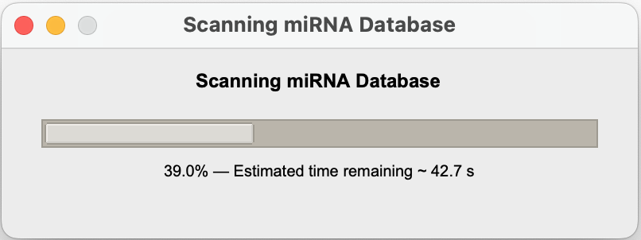
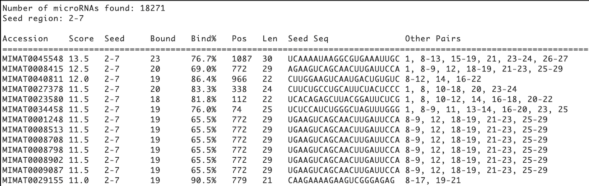

# Dynamite Mode - Database Scanning

## Overview

**Dynamite Mode** scans your target mRNA against a **database of ~48,860 known microRNAs** to identify ALL possible microRNA regulators in a single analysis.

Perfect for:
- ✅ Discovery: Find unknown microRNA regulators
- ✅ Exploration: Screen all possibilities at once
- ✅ Research: Identify potential regulatory networks
- ✅ Ranking: See which microRNAs are strongest binders

---

## How Dynamite Mode Works

### The Algorithm

```
Input: mRNA sequence + Seed region

For each of the ~48,860 microRNAs in database:
    1. Extract seed region (positions 2-7)
    2. Reverse complement it
    3. Search entire mRNA for matches
    4. If found:
        - Calculate full duplex alignment
        - Score all Watson-Crick pairs
        - Count wobble pairs
        - Compute binding strength %
    5. Store result with ranking score

Output: Sorted table (best to weakest binders)
```

### Processing Timeline

```
Start scanning...
10% — Estimated time remaining ~ 8.5 s
20% — Estimated time remaining ~ 7.2 s
...
100% — COMPLETE!

Results: 47 microRNAs can bind your mRNA
```

---

## Step-by-Step Analysis

### 1️⃣ Input: Target mRNA

Choose how to provide the mRNA:

#### Option A: GenBank ID
```
Select: ⊙ GenBank ID
Enter: NM_008539
```
**Fetches from**: NCBI Entrez  
**Auto-extracts**: 3'UTR region  
**Best for**: Known genes with published annotations

#### Option B: GenBank File
```
Select: ⊙ File
Choose: [Browse] → gene.gb
```
**Format**: GenBank file (.gb, .gbk)  
**Auto-extracts**: 3'UTR from CDS annotation  
**Best for**: Local data, custom annotations

#### Option C: FASTA File
```
Select: ⊙ File
Choose: [Browse] → sequence.fa
```
**Format**: FASTA file (.fa, .fasta)  
**Note**: Uses entire sequence (you manage content)  
**Best for**: Already-prepared 3'UTR sequences

#### Option D: Direct Sequence
```
Select: ⊙ Sequence
Paste: AUGAAACGCGAGCGACGAGC...
```
**Format**: Plain text  
**Best for**: Quick screening of short regions

---

### 2️⃣ Input: Seed Region

Specify the seed region criteria:

```
Seed: 2-7
```

Choose from:
- **2-7**: Standard (most commonly used)
- **2-8**: More stringent (higher specificity)
- **1-8**: Strictest (lowest false positives)
- **2-6**: Permissive (more candidates)

See [Matching Mode](matching_mode.md) for detailed explanation.

---

### 3️⃣ Run Full Scan

Click **[ Parse ]** button

**What Happens**:
1. Validates mRNA input
2. Opens database (~48,860 microRNAs)
3. Tests each microRNA against your mRNA
4. Progress window shows real-time status
5. Computes results in background (non-blocking UI)
6. Displays sorted results when complete

**Typical Duration**: 5-10 seconds

---

### 4️⃣ Monitor Progress

A progress window appears:

{: style="max-width: 350px;" }

**What it shows**:
- Percentage of database scanned
- Visual progress bar
- Estimated time to completion
- Updated in real-time

**During scanning**:
- ✅ Main window stays responsive
- ✅ You can view previous results
- ✅ Cannot start new scan until complete

---

## Understanding Results

### Result Table Format

{: style="max-width: 550px;" }

### Column Explanations

| Column | Meaning | Example |
|--------|---------|---------|
| **Accession** | microRNA ID (miRBase) | MIMAT0000062 |
| **Score** | Total pairing strength | 15.5 (higher = better) |
| **Seed** | Positions used for search | 2-7 (as specified) |
| **Bound** | Total nucleotides paired | 8 |
| **Bind%** | Percentage of microRNA that pairs | 80% |
| **Position** | Where binding starts in mRNA | 450 |
| **Length** | microRNA sequence length | 22 nucleotides |
| **microRNA Seq** | Actual seed sequence | CUGGGCAACAUAGCGAGACCCC |
| **Other Pairs** | Positions with pairs outside seed | 8-12,14-16 |

---

### Result Ranking

Results are **automatically sorted** by:

1. **Primary**: Score (highest first) = strongest binders
2. **Secondary**: Binding % (highest first) = most coverage

**What this means**:
- ✅ Top results are most likely genuine binders
- ✅ Each result represents a possible regulator
- ✅ You can quickly identify top candidates

---

## What High Results Mean

### Multiple Top Binders
```
Results: 47 microRNAs might3 bind your mRNA
Top 10 shown above...
```
**Meaning**:
- mRNA is heavily regulated
- Multiple regulatory pathways
- Target gene is biologically important
- Complex regulatory network

**Implication**: Important for gene expression control

### Single Strong Binder
```
Results: 3 microRNAs can bind your mRNA
Only 1 with good score...
```
**Meaning**:
- Specific microRNA-mRNA pair
- Clear regulatory relationship
- Primary regulator identified
- Simpler network

**Implication**: Primary regulatory mechanism identified

### No Results
```
No microRNA binding sites found with these parameters
```
**Possible Meanings**:
- This mRNA isn't microRNA-regulated
- All matches are weak/non-specific
- Wrong seed region
- mRNA not in 3'UTR format

**Troubleshooting**: Try different seed (2-8, 2-6)

---

## Exporting Results

Click **💾** button in top-right corner

**What gets saved**:
- Complete results table
- All statistics
- Input parameters
- Analysis timestamp

**Format**: Plain text file (.txt)  
**Default name**: `dynamite_results.txt`

**Use**: Archive, sharing, further analysis

---

## Understanding the Biology

### Why Multiple Binders?
Many genes are regulated by multiple microRNAs:
- **Diversity**: Different cellular conditions
- **Redundancy**: Multiple regulatory pathways
- **Specificity**: Different targeting combinations
- **Fine-tuning**: Gradual expression adjustment

### What Makes a Good Binder?
1. **Seed perfect match** (positions 2-7)
2. **Additional pairing** (strengthens binding)
3. **Energetically favorable** (stable duplex)
4. **In 3'UTR region** (accessible location)

### Seed Region Importance
- **Seed (2-7)**: MUST match exactly
- **Position 1 & 8+**: Extra pairing, bonus stability
- **Perfect alignment**: Not typically required
- **Wobble pairs**: Acceptable, weaken binding slightly

---

## Advanced Usage

### Comparing Different Seed Regions

Run analysis 3 times:
1. Seed 2-7 (standard)
2. Seed 2-8 (stringent)
3. Seed 2-6 (permissive)

Compare results:
- **2-7**: Balanced hit rate
- **2-8**: Fewer results, higher confidence
- **2-6**: More results, include marginal binders

### Finding Specific microRNAs

Results are sorted by score. To find a specific microRNA:
1. Run Dynamite scan
2. Export results
3. Search exported file for microRNA name/ID
4. Note its rank and score

### Focusing on 3'UTR Analysis

Best practice:
1. Use GenBank ID (auto-extracts 3'UTR)
2. Or provide GenBank file
3. Ensures biological relevance
4. Avoid false positives in coding region

---

## Tips & Tricks

### 🎯 Optimize Your Analysis
1. **Start with 2-7 seed** - most balanced
2. **Review top 5 results** - usually most relevant
3. **Check positions** - biological plausibility
4. **Use GenBank IDs** - automatic 3'UTR extraction

### ⚡ Speed Up Scanning
1. **Pre-filter sequences** - shorter = faster
2. **Use 2-8 seed** - slightly fewer matches = faster
3. **Local files** - faster than downloading IDs

### 🔍 Interpret Thoroughly
1. **Top 3-5 results** - most trustworthy
2. **Position analysis** - check if in 3'UTR
3. **Known interactions** - validate against literature
4. **Binding strength** - score correlates with strength

---

## Common Patterns

### Pattern 1: Let-7 Family Dominance
```
Top results include multiple let-7 family members
Indicates: Strong conservation, common target
```

### Pattern 2: Mixed Families
```
Results from diverse microRNA families
Indicates: Complex regulation, developmental importance
```

### Pattern 3: Single Clear Winner
```
One microRNA far above others
Indicates: Specific primary regulator
```

---

## Troubleshooting

**Q: Why is analysis slow?**  
A: Scanning 48,860 microRNAs takes time. Typical: 1-5 minutes. Be patient!

**Q: Can I get results in different order?**  
A: Results are always sorted by score. Export to .txt to manipulate manually.

**Q: What if I get too many results?**  
A: Try seed 2-8 (more stringent). Or manually filter high-score results.

**Q: Can I search subset of microRNAs?**  
A: Currently scans full database. Use Matching mode for specific microRNAs.

