# Getting Started

## Launching the Application

### Step 1: Open the Application

**macOS**: Open Applications folder → Double-click the app

The main window will appear with two tabs: **Matching** and **Dynamite**

---

## Main Interface Overview

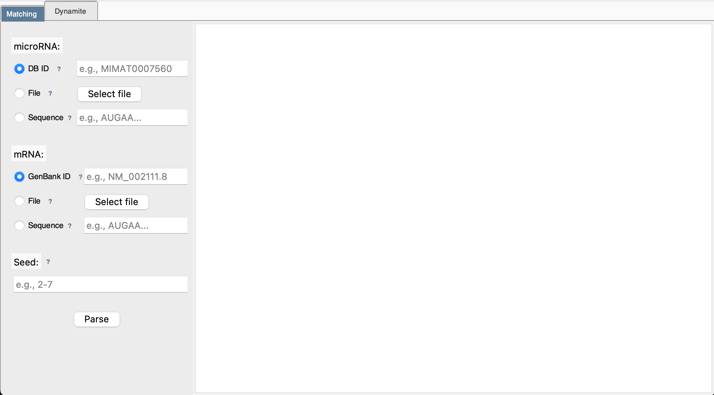

---

## Understanding Input Modes

Each input field (microRNA, mRNA, Seed) supports three entry methods. You'll see radio buttons to choose:

### 🔘 Mode 1: Database ID

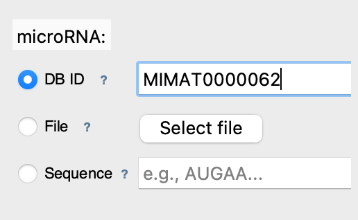{: style="max-width: 250px;" }

**What it does**: Fetches sequence directly from online database  
**Best for**: Quick access to known sequences  
**Examples**:
- microRNA IDs: MIMAT0000062 (mmu-let-7a)
- mRNA IDs: NM_000546.6 (TP53 gene)

### 📁 Mode 2: File Upload

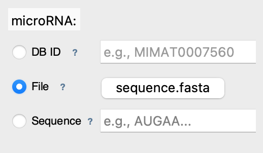{style="max-width: 250px;" }

**What it does**: Reads sequence from your computer  
**Best for**: Local data, custom sequences  
**Supported formats**:
- FASTA: `.fa`, `.fasta` (plain sequence)
- GenBank: `.gb`, `.gbk` (annotated sequence)

### ✏️ Mode 3: Direct Sequence

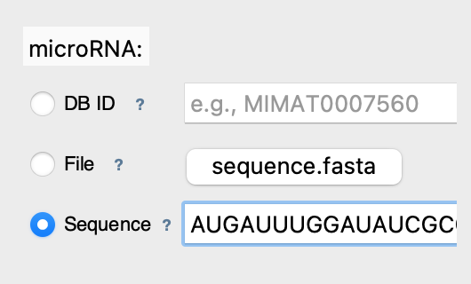{: style="max-width: 250px;" }

**What it does**: Analyzes text you type directly  
**Best for**: Quick tests, short sequences  
**Notes**: Whitespace is ignored, auto-converted to uppercase

---

## Choosing Your Analysis Mode

### 📍 Use MATCHING Mode When:
- You have a **specific microRNA** in mind
- You want to know **if it binds to your target mRNA**
- You need **detailed alignment visualization**
- You're **validating** a known interaction

✅ **Speed**: Instant (< 1 second)  
✅ **Output**: Detailed alignments + statistics

### 🔍 Use DYNAMITE Mode When:
- You want to **discover** which microRNAs bind your mRNA
- You have a target gene but **unknown regulators**
- You need to see all possible microRNA candidates
- You're doing **exploratory research**

⏱️ **Speed**: ~1-5 minutes (scans the 48,860 microRNAs of the miRBase DataBase)  
✅ **Output**: Ranked list of potential binders

---

## Your First Analysis: Matching Mode

### Step 1: Select microRNA
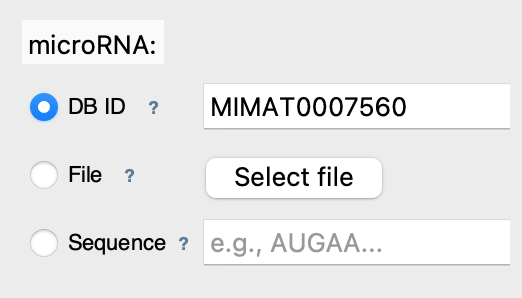{: style="max-width: 250px;" }

Enter microRNA ID: `MIMAT0007560` (mmu-mir-30a)

### Step 2: Select mRNA
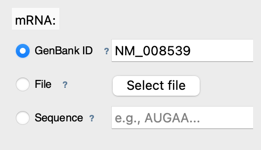{: style="max-width: 250px;" }

Enter mRNA GenBank ID: `NM_008539` (mouse SMAD1)

### Step 3: Set Seed Region
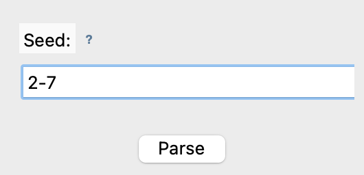{: style="max-width: 250px;" }

This is the standard seed region - usually 2-7 or 2-8

### Step 4: Run Analysis
Click **[Parse]** button and wait for results

### Step 5: View Results
Results appear in the right panel showing:
- Number of binding sites found
- Position of each site in mRNA
- Base pairing visualization
- Statistics (Watson-Crick pairs, wobble pairs)

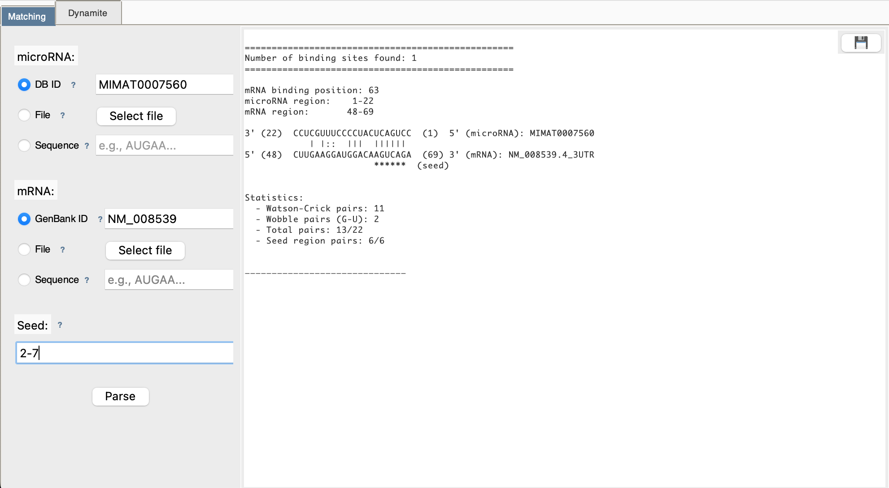{: style="max-width: 550px;" }

### Step 6: Download (Optional)
Click **💾** button to save results to a text file

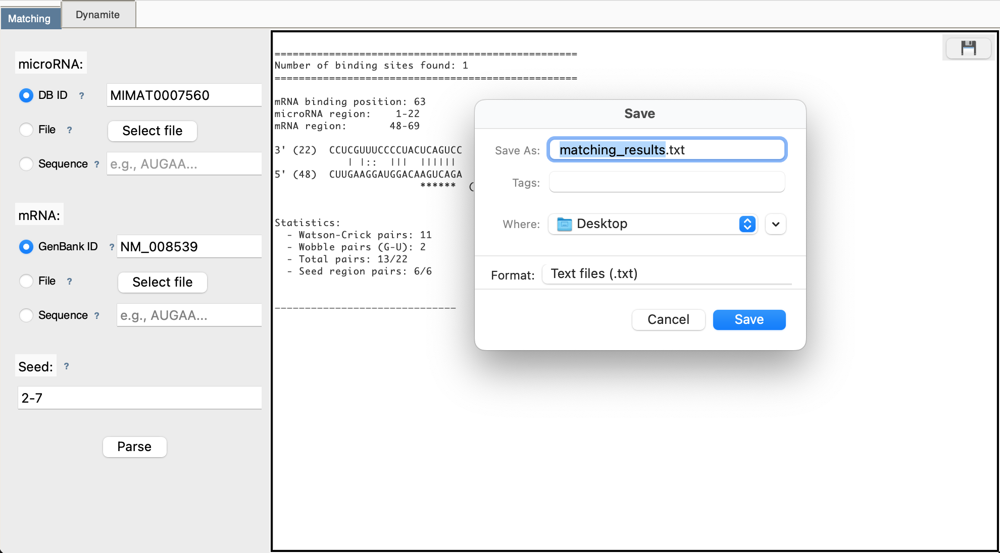{: style="max-width: 550px;" }
---

## Your First Analysis: Dynamite Mode

### Step 1: Select mRNA
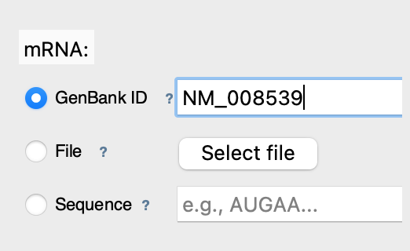{: style="max-width: 250px;" }

Enter mRNA GenBank ID: `NM_008539` (mouse SMAD1)

### Step 2: Set Seed Region
{: style="max-width: 250px;" }

### Step 3: Run Scan
Click **[Parse]** button

### Step 4: Wait for Results
A progress popup shows:

{: style="max-width: 350px;" }

### Step 5: View Results Table
After scanning completes, you see a table:

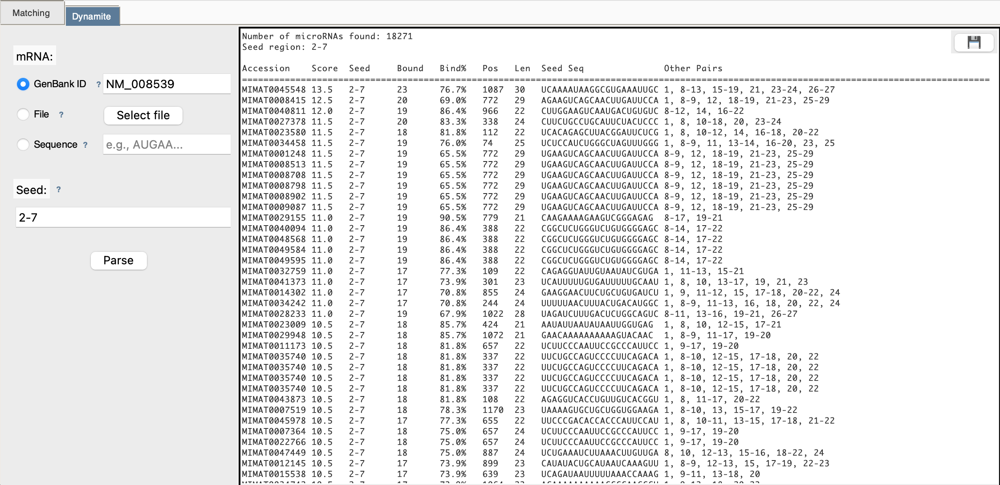{: style="max-width: 450px;" }

### Step 6: Download
Click **💾** to export the complete table

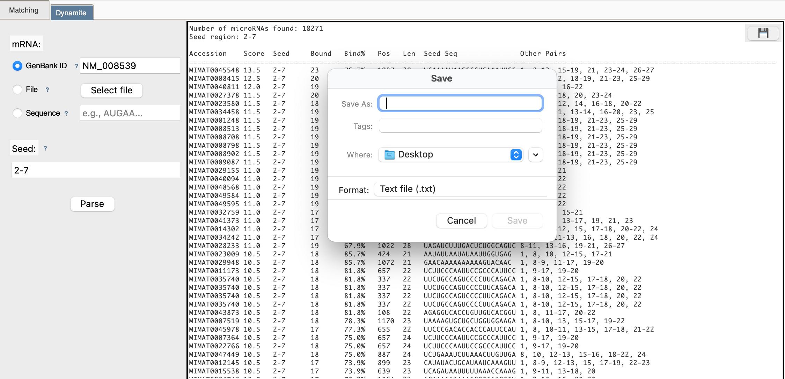{: style="max-width: 450px;" }
---

## Key Concepts to Remember

### 🧬 What is a "Seed Region"?
The seed region (typically positions 2-7 of the microRNA) is the most critical for binding. In this tool:
- **Positions are 1-indexed** (position 1 is the first nucleotide)
- **Typical range**: 2-7 (most important for binding)
- **Alternative**: 2-8 (more stringent)
- This region **MUST match perfectly** for a binding site to be detected

### 📊 What Do the Results Mean?
- **Position**: Where in the mRNA the binding site starts (1-indexed)
- **Watson-Crick Pairs**: Normal, strong base pairings (A-U, C-G)
- **Wobble Pairs**: Special G-U pairings (weaker but still valid)
- **Bind%**: Percentage of microRNA that pairs with mRNA
- **Score**: Total pairing strength (higher = better binding)

### 🔄 DNA vs RNA
- The tool automatically converts DNA (with T) to RNA (with U)
- You can paste either format - it will be handled correctly

---

## Next Steps

- 👉 Learn the [biology behind the analysis](../concepts/biology.md)
- 👉 Deep dive into [Matching Mode](../features/matching_mode.md)
- 👉 Explore [Dynamite Mode](../features/dynamite_mode.md)

